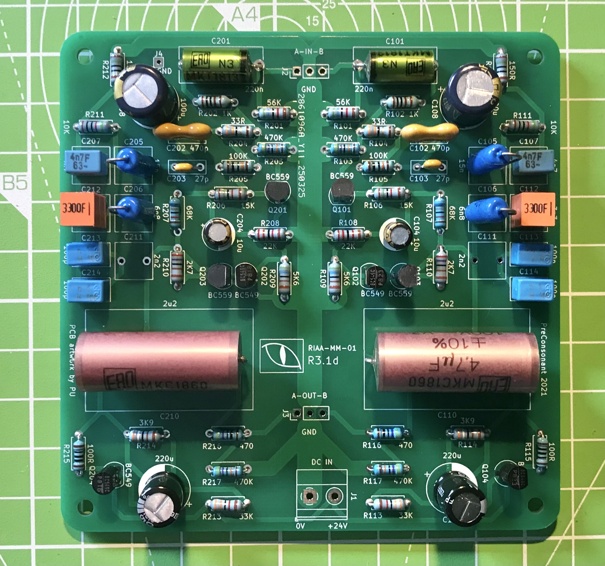

# PreConconant 2021

### Basic information

This repository contains all the information necessary to build a PreConsonant phono preamplifier.

The original circuit was first published in the Elektor magazine in 1978. In the 1980s it was one of the most popular DIY phono preamplifiers in Europe because of its low parts count and good performance.

My version of the PreConsonant features the following improvements compared to the original:

 - a much better PCB layout with full ground plane;
 - the PCB has enough space for audiophile grade components, namely input and output coupling capacitors;
 - increased gain (39dB at 1kHz vs 34dB at 1kHz for the original);
 - the level adjustment pots at the output has been removed; they probably made a lot of sense when the average integrated amplifier had input sensitivity of ~250mV and typical analogue sources, such as tuners, had output levels between 80 and 300mV. Today we live in a different world: most digital sources have output voltage of 2V RMS, and most amplifiers have much lower sensitivity than in the 1970s.
 
### Technical specifications

 - RIAA frequency response deviation: within +/- 1dB (provided that you use the recommended components for the RIAA network).
 - Input overload level at 1 kHz: 112 mV.
 - Overload margin: not less than 27dB (ref. 5mV input at 1kHz when powered from +24V supply).
 - Signal to noise ratio: greater than 72dB (ref. 5mV input at 1kHz).
 - Total harmonic distortion: less than 0.01% (ref 16mV input at 1kHz).
 - Recommended power supply: 24V DC.

### Documentation

The documentation (bill of materials, full schematic and build notes) is located in the `docs` folder.

### Status of the project

The PCB is now on its third major revision, it has been successfully built and tested multiple times. The current version (R3.1e) does not have any known defects and is considered to be the final revision.

### License

This project is © Pavel Urusov. Your use of the provided files is subject to the following terms and conditions:

0. **SCOPE OF THE LICENSE**: this license applies to the original PCB artwork(s) and circuit diagram(s) created by the copyright holder(s), as well as any accompanying documentation provided herewith, including (but not limited to) assembly instructions, photographs, video guides, and bills of materials, collectively referred to as "the project files". It does not apply to the circuit(s) themselves since they are not protected by copyright in most jurisdictions.
1. **NO WARRANTY OF ANY KIND**: While every reasonable effort has been made to ensure that the PCB artwork(s), circuit diagram(s) and accompanying documentation are free of substantial errors, the project files are provided with no warranties whatsoever, whether implied or explicit, including (but not limited to) the implied warranties of merchantability and fitness for a particular purpose. 
2. **NO COMPENSATION OF ANY KIND**: In no event until agreed to in writing shall the copyright holder(s) be liable to you for damages of any kind, including any general, special, incidental or consequential damages arising out of your use or inability to use the project files. Should the project files require any remedial works to be usable, the cost of any and all such works shall be borne by you, including (but not limited to) the cost of creating new PCB designs, ordering new PCBs or sourcing additional components.
3. **USE AT YOUR OWN RISK**: Assembling electronic apparatuses of any kind, especially those that are mains-powered, carries an inherent risk of injury, potentially leading to death. It is generally assumed that any such activity should be undertaken only by suitably qualified persons. If you attempt to use the project files to build your own electronic device(s), you do so entirely at your own risk. In no event shall the copyright holder(s) be held responsible for your safety and well-being.
4. **COPYRIGHT NOTICES**: Your use of the project files is contingent on preserving any copyright notices provided with the project, including (but not limited to) identification marks included with the PCB artwork (logos, copyright information, design codes, etc.) Under no circumstances are you permitted to remove the aforementioned notices and identification marks from the PCB artwork(s) or the finished product(s).
5. **REDISTRIBUTION:** You are free to redistribute the project files provided that: a) you do not modify them in any way; and b) you preserve this README file, license information and any and all copyright notices included with the project.
6. **NO DERIVATIVE WORKS**: You are not allowed to create derivative works (i.e. works that are substantially based on one or more of the project files) without an express written permission of the copyright holder(s).
7. **FREE FOR BOTH COMMERCIAL AND NON-COMMERCIAL USE**: you are free to use the project files for both non-commercial and commercial purposes (including, but not limited to, assembling finished products for sale) provided that you observe the terms and conditions of this license. 
